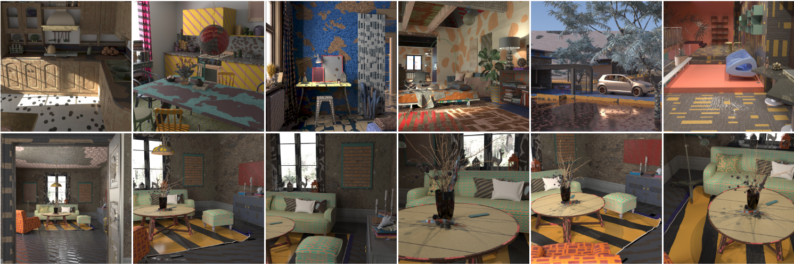

# DuMaS Dataset

This repository contains the public release of the **DuMaS** (Dual-level Material Selection) dataset from paper **Fine-Grained Spatially Varying Material Selection in Images** (SIGGRAPH Asia 2025).

### [](https://graphics.unizar.es/projects/MatSelection/) | [](https://graphics.unizar.es/projects/MatSelection/pdf/FineGrainedMatSelection_postprint.pdf)

Code coming soon!

[Julia Guerrero-Viu](http://webdiis.unizar.es/~juliagv/)<sup>1</sup>
[Michael Fischer](https://mfischer-ucl.github.io/)<sup>2</sup>
[Iliyan Georgiev](https://iliyan.com/)<sup>2</sup>
[Elena Garces](https://elenagarces.es/)<sup>2</sup>
[Diego Gutierrez](http://giga.cps.unizar.es/~diegog/)<sup>1</sup>
[Belen Masia](http://webdiis.unizar.es/~bmasia/)<sup>1</sup>
[Valentin Deschaintre](https://valentin.deschaintre.fr/)<sup>2</sup>


<sup>1</sup>Universidad de Zaragoza, I3A (Spain) 

<sup>2</sup>Adobe Research (UK)



## Download
You can download the public release of the **DuMaS** dataset from the following links
* Training data [~62GB]
* Test data [~5GB]
Each link will download a zip file containing all the train/test images as exr files.

## File Format
Each file is named as:
```
seed[X]_scene[Y]_frame[Z]_hiermatid.exr
```
Where:
- **seed[X]** — X is an integer indicating the material assignment seed. Different seeds correspond to different material configurations of the scene.
- **scene[Y]** — Y is the scene unique ID.
- **frame[Z]** — Z is the frame index within the scene.

All files are in **OpenEXR (.exr)** format and contain **three channels**:
1. **RGB** — the standard rendered color image.
2. **SVBRDF_ID** — the texture ID annotation per pixel.
3. **BRDF_ID** — the subtexture ID annotation per pixel.


## Citation
If you find this dataset useful, please cite it:
```
@article{guerrero2025matselection,
  title={{Fine-Grained Spatially Varying Material Selection in Images}},
  author={J. {Guerrero-Viu} and M. {Fischer} and I. {Georgiev} and E. {Garces} and D. {Gutierrez} and B. {Masia} and V. {Deschaintre}}, 
  journal = {ACM Transactions on Graphics (Proc. SIGGRAPH Asia)},
  year = {2025}
}
```


